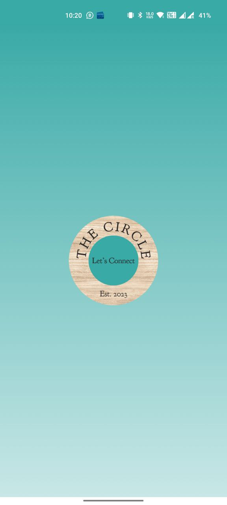
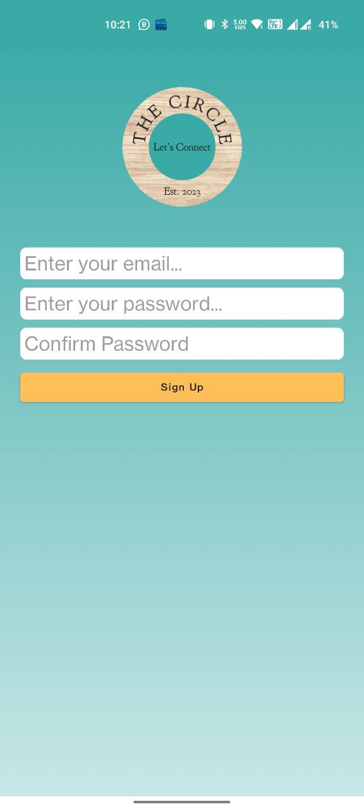
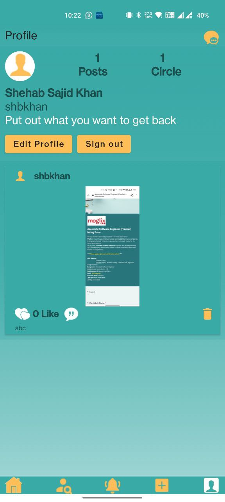
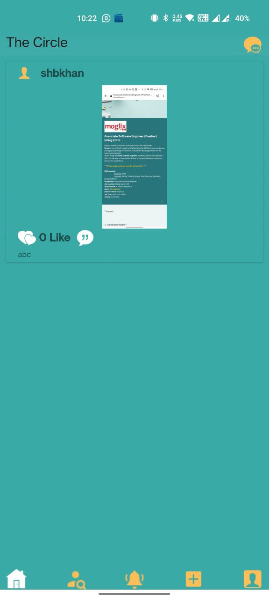
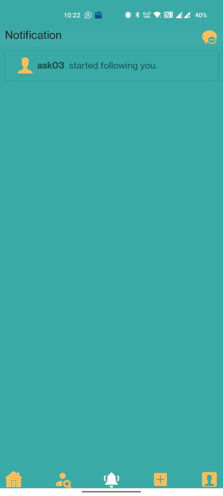
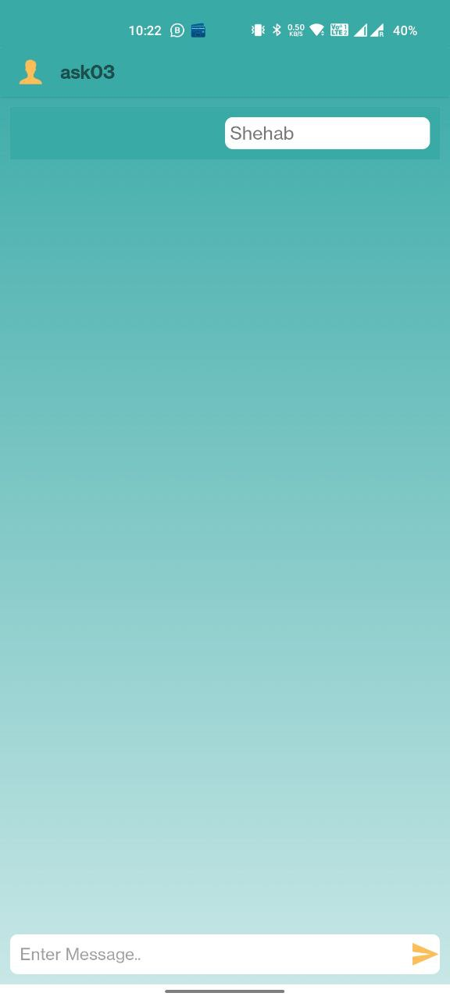

# The Circle
"The Circle" is a social media Android application developed using Java in Android Studio. It uses Firebase for the database to provide a secure and reliable experience to the users.

## Getting Started
To use the app, you need to register with your email and password. After registration, you can set up your account and choose a unique username. This username is necessary to find and follow other users on the platform. Once you have created your account, you can upload photos that will be visible to other users of the app. You can also like and comment on other users' photos.

## Features
**Registration and Login:** Users can create an account using their email and password. After that, they can log in to their account whenever they want.

**Account Setup:** Once logged in, users can set up their account by choosing a unique username.

**Forgot Password:** While signing in, if the user forgets his/her password, it can be reset by entering the email address associated with the account. A reset password email will be sent to the user, which will allow him/her to reset their password.

**Following a user:** A user can search and follow another user using the unique username.

**In-app notification:** For every action associated with the account i.e. likes, comments and follows, the user will get an in-app notification

**Upload Photos:** Users can upload photos that will be visible to other users of the app.

**Like and Comment:** Other users can like and comment on your photos, and you can do the same on theirs.

**Real-time Messaging:** The application also gives the functionality of real-time messaging to the followers, which can help users interact with each other better.

**Delete Posts:** Users can delete their own posts if they wish to.

## Snapshots

  
Splash Screen

  

  
Login/Signup Page

  

  
Signup Page

  
  

  
Account Setup

  

  
Homepage

  

  
MainScreen

  

  
Edit Profile

  

  
New Post

  

  
Notification

  

  
Message

  

